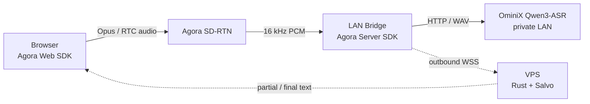

# Agora × OminiX private ASR

客户端集成 Agora Web SDK，把麦克风音频发进 RTC 频道；当前电脑上的 Bridge 以 Agora Server SDK 入会并接收 16 kHz 单声道 PCM，再调用本机 OminiX-API/Qwen3-ASR。公网 VPS 只跑 Rust + Salvo 控制面，负责鉴权、动态 Token、会话和识别文本转发，不承载音频或推理。

已获领导认可的 Demo 已冻结在 Git 标签 `demo-approved-2026-09-01`；当前分支开始生产化，不会改写该基线。

## 架构



关键边界：OminiX-API 和内网 Bridge 都不需要公网入站端口；Bridge 主动连接 Agora 和 VPS。客户端确实需要集成 Agora RTC SDK，本 Demo 的浏览器实现位于 `control-plane/static/app.js`。

## 生产运行：唯一主流程

前置条件：OminiX-API/Qwen3-ASR 已在当前电脑的 `127.0.0.1:8080` 运行；VPS 子域已配置 HTTPS；VPS 持有 Agora App ID 与 App Certificate，用于动态签发短期 AccessToken2。

当前 Mac 启动 OminiX Qwen3-ASR：

```bash
cd /Users/alan0x/Documents/projects/agora-sensevoice-demo/bridge
bash start-ominix-asr.sh
```

保持该终端运行，再在另一个终端启动 Bridge。

1. Windows 构建并打包 VPS 控制面镜像，再上传 VPS。完整命令见 [`docs/WINDOWS_CODEX_HANDOFF.md`](docs/WINDOWS_CODEX_HANDOFF.md)。
2. VPS 创建 `deploy/.env`，使用真实配置：

   ```dotenv
   PUBLIC_BASE_URL=https://asr.pitun.cc
   ALLOWED_ORIGIN=https://asr.pitun.cc
   BRIDGE_SHARED_SECRET=<独立随机密钥>
   CLIENT_ACCESS_TOKEN=<另一个独立随机密钥>
   DEMO_MODE=false
   AGORA_APP_ID=<APP_ID>
   AGORA_APP_CERTIFICATE=<APP_CERTIFICATE>
   RTC_CHANNEL_PREFIX=asr
   RTC_CLIENT_UID=1001
   RTC_BRIDGE_UID=9001
   RTC_TOKEN_TTL_SECONDS=1200
   ```

3. VPS 只启动控制面：

   ```bash
   docker compose --env-file deploy/.env \
     -f deploy/docker-compose.yml up -d --no-build
   ```

4. 当前电脑启动真实 Bridge：

   ```bash
   cd bridge
   cp .env.example .env
   # 编辑 .env，只需替换 VPS 子域和共享密钥
   bash start-real.sh
   ```

   当前 Mac 的 `.venv` 已用 `/Users/alan0x/miniconda3/bin/python3.13` 创建并安装完整依赖，无需重装。`start-real.sh` 会先检查配置和 OminiX 健康状态，再启动真实 Bridge。

5. 打开 HTTPS 页面，输入 `CLIENT_ACCESS_TOKEN`，点击“开始识别”，授权麦克风并讲话。页面显示的文字来自本机 OminiX Qwen3-ASR 实际推理。

在启动 Agora 前，可单独确认当前 OminiX ASR HTTP 链路：

```bash
cd bridge
python smoke_sensevoice_live.py /path/to/16k-mono.wav
```

本仓库已针对当前 OminiX-API 的 JSON + base64 协议实现并实际验证。生产迁移与验收见 [`docs/PRODUCTION_RUNBOOK.md`](docs/PRODUCTION_RUNBOOK.md)。

如果在 Windows + Docker Desktop 上交叉构建 Linux 镜像、制作离线包并上传 VPS，请直接交给下一位 Codex 阅读 [`docs/WINDOWS_CODEX_HANDOFF.md`](docs/WINDOWS_CODEX_HANDOFF.md)。该文档明确保持“当前电脑运行 OminiX ASR/真实 Bridge，VPS 只运行控制面”的最终边界。

## 项目布局

```text
control-plane/  Rust + Salvo API、WebSocket 与静态演示页
bridge/         Agora Python Server SDK 接收器、断句器、ASR 适配器
deploy/         Docker Compose、环境变量与 Nginx 示例
docs/           协议与真实演示检查清单
```

## 当前生产化基线

- VPS 后端按会话签发 AccessToken2 `007` 短期 Token，使用独立随机频道；App Certificate 不下发客户端或 Bridge。
- 会话 API 使用独立访问密钥；浏览器事件票据使用路径限定的 HttpOnly Cookie，不出现在 URL。
- 提供 liveness/readiness、Nginx 边缘限流、会话过期回收、断线释放和 Mac LaunchAgent 守护。
- 文本通过 VPS WebSocket 回传，音频通过 Agora RTC；第一版不引入 RTM。
- OminiX 当前是单路推理 worker，所以服务容量明确为 1；多 worker 路由是下一阶段。

下一阶段是企业 OIDC/SSO、Redis/PostgreSQL 会话与审计、多个 OminiX worker 调度、Prometheus/告警，并评估把 Agora Server SDK Bridge 迁至官方支持的 Linux 环境。

仓库仍保留 `mock-bridge`，仅供开发者隔离控制面故障，不属于部署或验收路径。

## 本地检查

```bash
make check
```

要求：Rust 1.96+、Python 3.10+、Node.js。Docker 部署只需要 Docker Engine + Compose plugin。

## 参考

- [Agora Web SDK 文档](https://doc.shengwang.cn/doc/rtc/javascript/resources)
- [Agora Python Server SDK](https://github.com/AgoraIO-Extensions/Agora-Python-Server-SDK)
- [Salvo WebSocket API](https://docs.rs/salvo/latest/salvo/websocket/)
