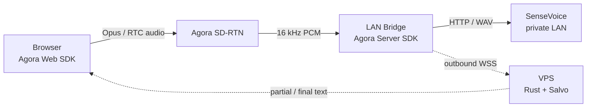

# Agora × SenseVoice private ASR demo

一个可快速展示、再逐步切到真实链路的端到端 Demo：客户端集成 Agora Web SDK，把麦克风音频发进 RTC 频道；公司内网的 Bridge 以 Agora Server SDK 入会并接收 16 kHz 单声道 PCM，再调用本地 SenseVoice。公网 VPS 只跑 Rust + Salvo 控制面，负责会话和识别文本转发，不承载音频或推理。

## 架构



关键边界：SenseVoice 和内网 Bridge 都不需要公网入站端口；Bridge 主动连接 Agora 和 VPS。客户端确实需要集成 Agora RTC SDK，本 Demo 的浏览器实现位于 `control-plane/static/app.js`。

## 五分钟跑出无凭据 Demo

这个模式验证 UI、VPS、会话控制、Bridge 心跳、partial/final 文本的完整链路；它故意不申请麦克风，也不加入 Agora。

```bash
git clone <this-repository>
cd agora-sensevoice-demo
cp deploy/.env.example deploy/.env

# 把 deploy/.env 里的 BRIDGE_SHARED_SECRET 换成这个输出
openssl rand -hex 24

docker compose --env-file deploy/.env \
  -f deploy/docker-compose.yml --profile mock up -d --build
```

浏览器访问 `http://VPS_IP:18080`。如果已经配置域名和证书，就把 Nginx 反代到 `127.0.0.1:18080`，参考 `deploy/nginx.conf.example`，然后访问 HTTPS 子域；同时把 `PUBLIC_BASE_URL` 和 `ALLOWED_ORIGIN` 都改成这个准确的 `https://` 地址。

查看状态与日志：

```bash
curl http://127.0.0.1:18080/healthz
curl http://127.0.0.1:18080/api/v1/status
docker compose --env-file deploy/.env -f deploy/docker-compose.yml --profile mock logs -f
```

## 切换到真实 Agora + SenseVoice

1. 在 Agora 控制台准备同一频道的两个临时 RTC Token：浏览器 UID `1001`，Bridge UID `9001`。
2. VPS 的 `deploy/.env` 设置 `DEMO_MODE=false` 并填写 App ID、UID、两个 Token。
3. VPS 只启动控制面：

   ```bash
   docker compose --env-file deploy/.env -f deploy/docker-compose.yml up -d --build
   ```

4. 在能访问 SenseVoice 的内网 Linux 主机启动真实 Bridge：

   ```bash
   cd bridge
   python3.10 -m venv .venv
   . .venv/bin/activate
   pip install -r requirements.txt

   export CONTROL_WS_URL=wss://asr-demo.example.com/ws/bridge
   export BRIDGE_SHARED_SECRET='<与 VPS 相同的随机值>'
   export SENSEVOICE_URL=http://127.0.0.1:8000/v1/audio/transcriptions
   python -m bridge.main --mode real
   ```

5. 打开 HTTPS 页面，点击“开始识别”并授权麦克风。

完整操作清单见 [`docs/REAL_DEMO_CHECKLIST.md`](docs/REAL_DEMO_CHECKLIST.md)。如果现有 SenseVoice HTTP 接口不是 OpenAI-compatible multipart 格式，只需要修改 `bridge/bridge/sensevoice.py`。

如果在 Windows + Docker Desktop 上交叉构建 Linux 镜像、制作离线包并上传 VPS，请直接交给下一位 Codex 阅读 [`docs/WINDOWS_CODEX_HANDOFF.md`](docs/WINDOWS_CODEX_HANDOFF.md)。该文档明确保持“当前电脑运行 SenseVoice/真实 Bridge，VPS 只运行控制面”的最终边界。

## 项目布局

```text
control-plane/  Rust + Salvo API、WebSocket 与静态演示页
bridge/         Agora Python Server SDK 接收器、断句器、ASR 适配器
deploy/         Docker Compose、环境变量与 Nginx 示例
docs/           协议与真实演示检查清单
```

## Demo 的有意简化

- 单并发、内存会话、固定频道与固定 UID。
- RTC Token 由 Agora 控制台提前生成；不会把 App Certificate 放进服务或客户端。
- 文本通过 VPS WebSocket 回传，音频通过 Agora RTC；第一版不引入 RTM。
- mock 和真实模式使用相同 UI 与控制协议。

这些约束适合快速给老板验证方向。生产化下一步是接入官方 AccessToken2 builder 动态签发短期 Token，然后加入鉴权、限流、多会话路由、指标和断线恢复。

## 本地检查

```bash
make check
```

要求：Rust 1.96+、Python 3.10+、Node.js。Docker 部署只需要 Docker Engine + Compose plugin。

## 参考

- [Agora Web SDK 文档](https://doc.shengwang.cn/doc/rtc/javascript/resources)
- [Agora Python Server SDK](https://github.com/AgoraIO-Extensions/Agora-Python-Server-SDK)
- [Salvo WebSocket API](https://docs.rs/salvo/latest/salvo/websocket/)
